This plugin provides:

* a payment form,
* a payment history,
* automatic creation of contributions in Galette once payments are validated.

**Note**: this plugin requires **Galette version 1.2.1 or later**.

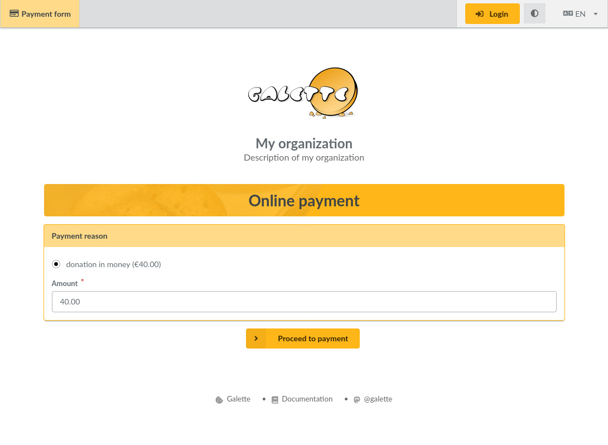

**Important**: to use this plugin, your instance of Galette must be publically accessible and served in https.

## Installation

First of all, download the plugin:

[](https://github.com/galette-community/plugin-stripe/releases/tag/1.0.0-alpha1)

Extract the downloaded archive into Galette `plugins` directory. For example, on linux (replacing *{url}* and *{version}* with the corresponding values):

```
$ cd /var/www/html/galette/plugins
$ wget {url}
$ tar xjvf galette-plugin-stripe-{version}.tar.bz2
```

## Database initialisation

In order to work, this plugin requires several tables in the database. See the [Galette plugins management interface](https://doc.galette.eu/en/master/plugins/index.html#plugins-managment).

And that’s it, the *Stripe* plugin is installed. :)

## Plugin usage

When the plugin is installed, a Stripe group is added to the Galette menu when a user is logged in, allowing administrators and staff members to define the settings of the plugin and view payment history.

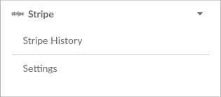

The payment form is accessible from Galette's public pages.

Only users logged into their account can pay contributions with a membership extension (or membership fees).

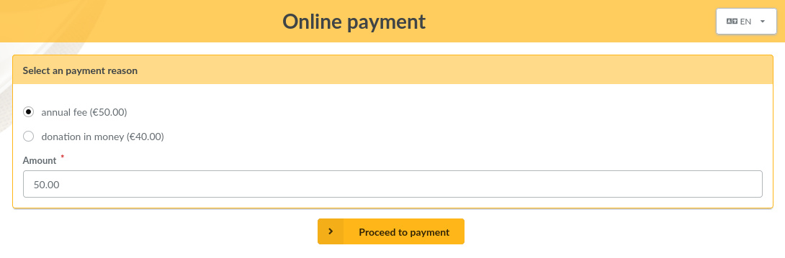

Regular visitors (users not logged into their account) can only pay contributions without a membership extension (or donations). In this case, no contribution is automatically created in Galette, the payment only appears in the plugin's payment history.

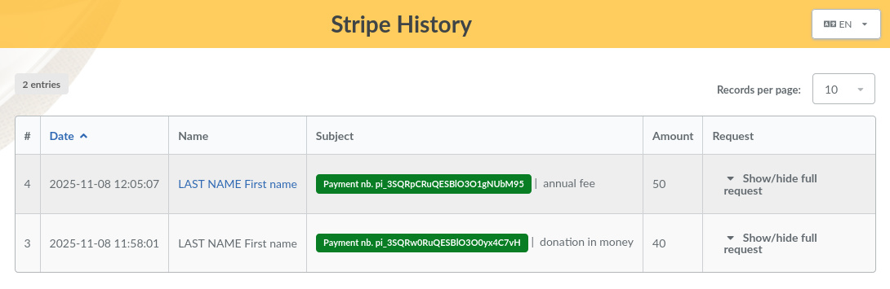

## Settings

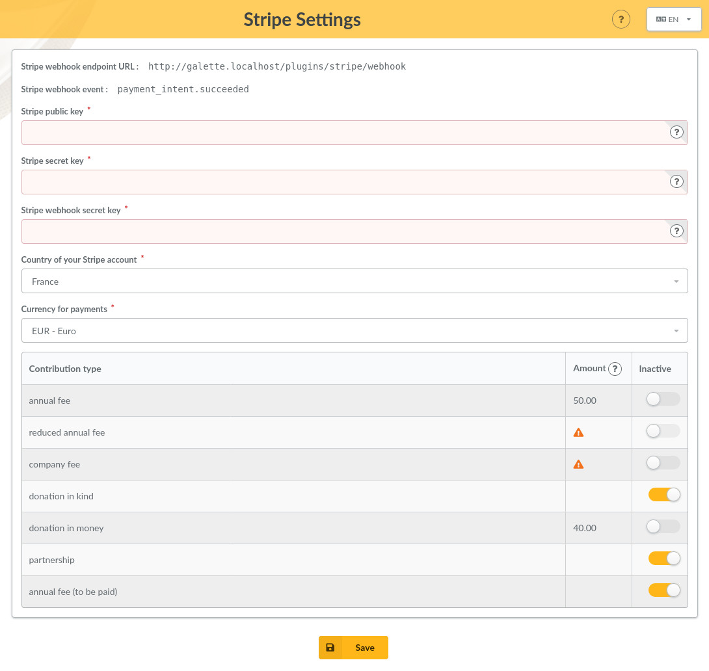

* **Stripe webhook endpoint URL**: URL to use to create a “Webhook” in your association’s account on Stripe ([read more below](#create-a-webhook)).
* **Stripe webhook event**: name of the event to use to create a “Webhook” in your association’s account on Stripe ([read more below](#create-a-webhook)).
* **Stripe public key**: you will find this information in your association’s account on Stripe ([read more below](#create-api-keys)).
* **Stripe secret key**: you will find this information in your association’s account on Stripe ([read more below](#create-api-keys)).
* **Stripe webhook secret key**: you will find this information in the details of the "Webhook" you need to create in your association’s account on Stripe ([read more below](#create-a-webhook)).
* **Country of your Stripe account**: choose a country according to your Stripe account settings ([read more below](#set-a-country-and-a-currency)).
* **Currency for payments**: choose a currency according to your Stripe account settings ([read more below](#set-a-country-and-a-currency)).
* **Contribution types**: in this table, you can disable [contribution types configured in Galette](https://doc.galette.eu/en/master/usermanual/contributions.html#contributions-types) that you do not want to be offered as a payment reason on the online payment form.

  *Contribution types with a zero amount, or whose amount is not configured, will not be offered as payment reasons on the form, even if they are not marked as inactive in the table.*

### Note about the sandbox mode

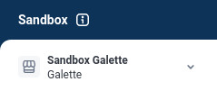

It is recommended to test the plugin's functionality in sandbox mode. To learn how to set up such a testing environment, please refer to the [Stripe documentation](https://docs.stripe.com/sandboxes).

**Warning**: in this mode, do not use real credit card numbers, but only test cards (see the list of test cards in [Stripe documentation](https://docs.stripe.com/testing#cards)).

## Configure your Stripe account

To learn how to create an account, please refer to the [Stripe documentation](https://docs.stripe.com/get-started/account).

### Get the country and currency defined in your account settings

The choice of a country and a currency is usually requested when creating your account. You can find this information in your account settings:

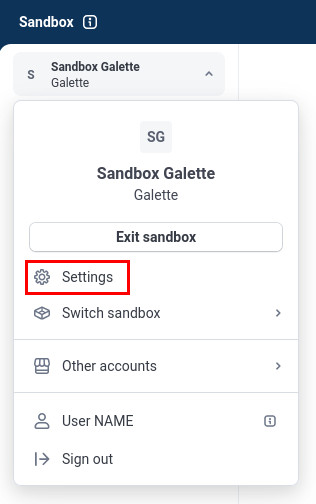

* *Settings > Business > Account details*

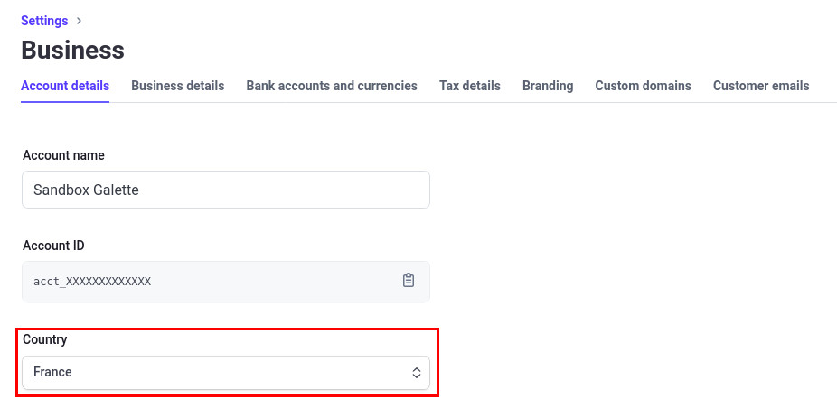

* *Settings > Business > Bank accounts and currencies*

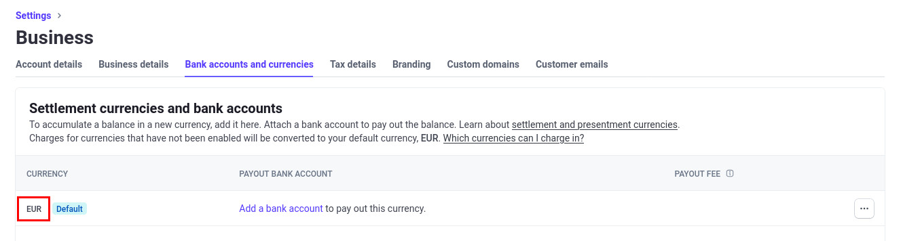

### Create a Webhook and get the corresponding secret key

The *Webhook* required for the proper functioning of the plugin can be created from the *Developers* menu (located at the bottom left of your dashboard):


The *Endpoint URL* to define in your webhook is indicated in the plugin settings (example: `https://YOUR_DOMAIN_NAME/plugins/stripe/webhook`).

Only one *Event* needs to be defined in your webhook. It is also indicated in the plugin settings; it is `payment_intent.succeeded`.

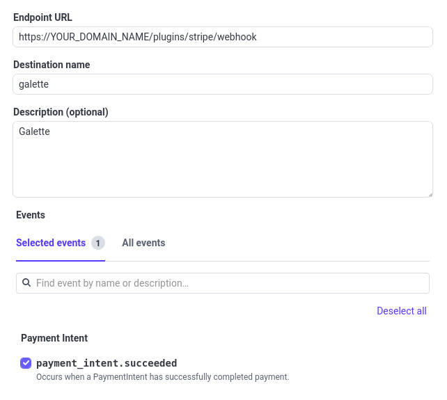

Once created, you need to get the *webhook secret key* to define in the plugin settings. From the list of webhooks, click on the one your created:

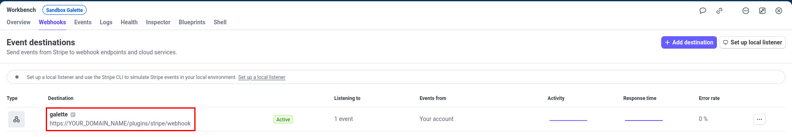

The *webhook secret key* can be copied from it's details:

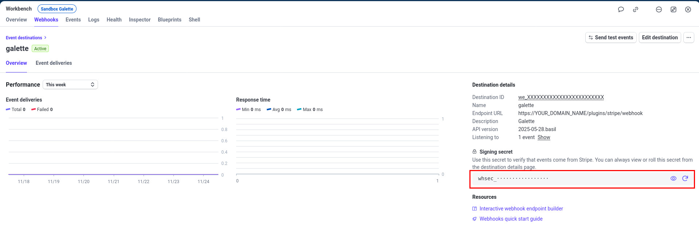

### Get the API keys

The *API keys* required for the proper functioning of the plugin can be obtained from the *Developers* menu (located at the bottom left of your dashboard):

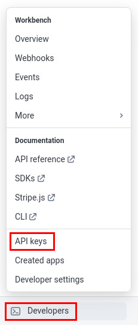

**Important**: To reduce the potential impact of a compromise, create a *Restricted key*. This key can be created without customizing the permissions. Please refer to the [Stripe documentation](https://docs.stripe.com/keys#create-restricted-api-secret-key) for more information about restricted keys.

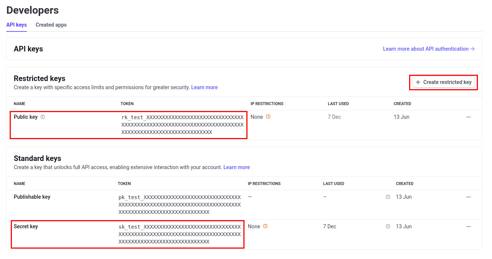

### Enable the necessary payment methods

Stripe offers many payment methods. In your account settings, you should enable only the methods you wish to use.

**Warning**: do not enable delayed payment methods (Multibanco, ACH direct debit, SEPA direct debit, Bank transfer), because the different corresponding payment statuses are not handled by the plugin at the moment and they cannot be tracked in the history.

* *Settings > Payments > Payment methods*

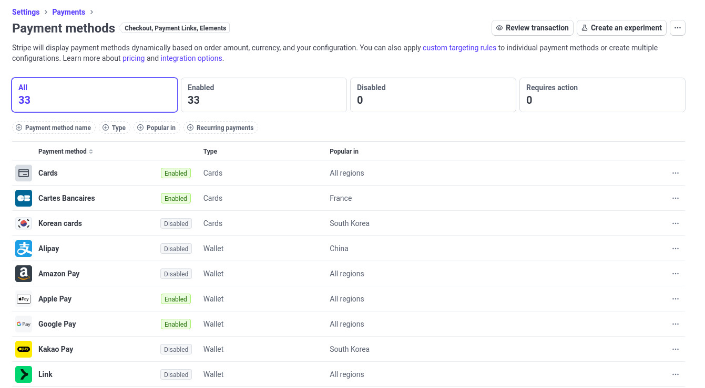
