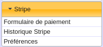

## Installation

S'agissant d'un plugin pour [Galette](https://galette.eu), vous devez obligatoirement avoir installé préablement un serveur avec Galette en version 0.9.4 minimum.

Dézippez l'archive dans le répertoire plugins de Galette.

Rendez vous sur la page de configuration des plugins, comme décrit [dans la documentation Galette](https://galette.eu/documentation/fr/plugins/index.html), activez le plugin _Galette Stripe_ si ce n'est pas fait, et lancez la procédure de création des tables SQL.

Vous devriez avoir 3 nouvelles tables dans la base de données :

* `galette_stripe_history` : stocke les informations relatives aux webhooks reçus par le site
* `galette_stripe_preferences` : stocke les préférences du plugin : clés publiques et secrètes, pays, devise
* `galette_stripe_types_cotisation_prices` : stocke les prix des contributions facturées par le plugin

## Configuration

* Pour commencer, vous devez [ajouter vos clés API](#clés-api).
* Ensuite si nécessaire, [créer un webhook](#créer-un-webhook) et [renseigner le secret](#secret-du-webhook).
* Enfin, ajoutez les [prix des contributions](#contributions) pour les adapter à votre association.

La [liste des paramètres](parametrage) est disponible pour référence.

## Clés API

### Récupérer les clés dans Stripe

Rendez-vous dans votre interface de Stripe, sous le menu **Développeurs** puis **Clés API**, et récupérez votre clé publique.

Créez ensuite une clé secrète limitée, ou utilisez la clé secrète principale. En principe, le plugin n'a besoin que des autorisations principales et les autorisations de Issuing. La clé n'a pas besoin des autorisations liées aux webhooks pour que le plugin reçoive les webhooks, les webhooks sont configurés dans l'interface de Stripe.

**Attention** : faites un essai avec les clés de Test avant d'utiliser les clés Live. Les clés de test sont préfixées **\_test\_** et se créent en mode Test.

En mode Test, les cartes à utiliser sont : https://stripe.com/docs/testing#cards . **N'utilisez pas de CB réelle en mode Test**, c'est interdit par les CGU de Stripe, et la carte pourrait être débitée pour de vrai.

### Renseignez les clés dans Galette

Allez sur la page **Préférences** du plugin et renseignez vos clés publique et secrète.

## Créer un webhook

Le chemin de votre webhook est indiqué dans la page Préférences du plugin, celui-ci est de la forme `https://VOTRE_URL_GALETTE/plugins/stripe/webhook` .

Rendez-vous dans l'interface de Stripe, sous le menu **Développeurs** puis **Webhooks**, et créez votre webhook.

L'événement à envoyer est `payment_intent.succeeded`. Les autres événements se sont pas traités par le plugin.

Cette URL doit être publiquement accessible pour que les webhooks fonctionnent.

## Secret du webhook

### Récupérez le secret du Webhook dans Stripe

Stripe utilise le secret du webhook pour signer la requête envoyée via une fonction HMAC SHA-256. Le plugin vérifie la signature de la requête avant tout traitement du webhook.

Cliquez sur le webhook dans la liste, puis récupérez le secret du webhook en cliquant sur "Révéler".

**Celui-ci est différent de votre clé secrète et se trouve dans les détails du webhook, pas dans "Clé API"**.

### Renseignez le secret du webhook dans Galette

Allez sur la page **Préférences** du plugin et renseignez le secret du webhook.

**Attention** : toute cette configuration doit être ensuite répétée en mode Live, si vous êtes en train de le configurer en mode Test.

## Contributions

Comme pour le plugin Paypal pour Galette, le prix des contributions est paramétrable dans les **Préférences** du plugin.

Chaque contribution peut étendre l'adhésion ou non, consultez les paramètres de Galette sous **Types de contributions** pour régler l'extension ou non de l'adhésion selon les contributions.

Une contribution marquée "inactif"" ne sera pas proposée au paiement.

Le prix de la contribution est un minimum et n'empêche pas l'adhérent de spécifier un montant supérieur au moment du paiement.

**À noter** : Si un adhérent paie deux fois une contribution dont le paramètre __Extension d'adhésion__ est à __Oui__, le plugin enregistrera deux adhésions consécutives, prolongeant de deux périodes l'adhésion (pas de paiement double sur une seule période). Par exemple, si en 2020 l'adhérent paie deux fois la contribution __Cotisation annuelle__, sa date d'échéance sera 2022.

Rendez-vous dans les paramètres de Galette sous __Type de contribution__ pour configurer l'extension de l'adhésion pour certaines contributions.
